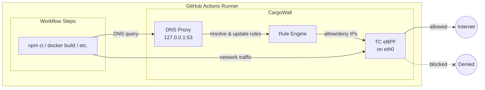

# CargoWall

[](https://github.com/code-cargo/cargowall/actions/workflows/ci.yml)
[](https://github.com/code-cargo/cargowall/actions/workflows/release.yml)
[](https://opensource.org/licenses/Apache-2.0)

**The firewall for GitHub Actions.**

CargoWall is an **eBPF-based network firewall for GitHub Actions runners** that monitors and controls outbound connections during CI/CD runs.

It protects your pipelines from **malicious actions, dependency supply chain attacks, and secret exfiltration** — with just a single step added to your workflow jobs.

CargoWall is open source and built by the team behind CodeCargo.

**Get started with the [CargoWall GitHub Action](https://github.com/code-cargo/cargowall-action).**

---

# Why This Exists

Modern CI/CD pipelines run **untrusted code** every day.

Your workflows execute:

* third-party GitHub Actions
* package installers
* build tools
* test frameworks
* deployment scripts

All with access to **sensitive credentials**:

* cloud keys
* registry tokens
* deploy keys
* signing secrets

If one dependency or action is compromised, attackers can silently:

* exfiltrate secrets
* tamper with build artifacts
* push malicious releases

This has already happened across the ecosystem.

CI/CD pipelines are now **one of the largest attack surfaces in software delivery**.

CargoWall exists to **put a firewall in front of your pipeline.**

---

# What CargoWall Does

CargoWall runs inside the GitHub runner and:

* monitors all outbound network connections
* blocks unauthorized destinations
* detects unexpected network activity
* prevents secret exfiltration
* logs all external connections made by the workflow

This is enforced using **kernel-level eBPF hooks** for minimal overhead and strong enforcement.

---

# What Makes CargoWall Different

Most CI/CD security tools are **static scanners**.

CargoWall protects the pipeline **while it is running**.

* **Runtime network firewall** — not a static scanner, enforces policy while your workflow runs
* **Kernel-level eBPF enforcement** — TC egress filters in kernel space, not userspace proxies
* **Process attribution** — every connection is traced back to the process and PID that initiated it
* **Dynamic DNS resolution** — hostname rules are resolved at runtime via a local DNS proxy
* **Audit and enforce modes** — start with visibility, then switch to blocking when ready
* **NDJSON audit logs** — machine-readable logs for compliance evidence and SIEM integration

---

# Get Started

Add the [CargoWall GitHub Action](https://github.com/code-cargo/cargowall-action) to your workflow:

```yaml
- uses: code-cargo/cargowall-action@v1
  with:
    default-action: deny
    allowed-hosts: |
      github.com,
      registry.npmjs.org
```

Hostname rules support **glob patterns** for matching dynamic hostnames:

- `*` matches exactly one DNS label
- `**` matches one or more DNS labels
- Wildcards must be a full dot-separated segment — partial wildcards like `google.co*` are not supported

```yaml
allowed-hosts: |
  github.com,
  actions.githubusercontent.com.*.*.internal.cloudapp.net,
  **.storage.azure.com
```

**Search domains** whitelist whole DNS suffixes for resolution without per-hostname tracking. Typical use case: you've allowed a VPC CIDR for internal traffic and want DNS resolution to work for any name under that VPC's internal suffix.

```yaml
search-domains: |
  .compute.internal
  .ec2.internal
```

The action input above (`search-domains`) corresponds to `searchDomains` in JSON config, `CARGOWALL_SEARCH_DOMAINS` in env, and `search_domains` in the protobuf policy.

Each user-configured suffix has two effects:

- **Stripping before rule matching** — a rule for `bastion` matches `bastion.compute.internal`.
- **Bypass for unmatched DNS queries** — any name ending in the suffix passes the DNS proxy when no hostname rule matches it. An explicit `deny` rule (e.g. for `blocked.compute.internal`) still wins.

Matching is case-insensitive; when configured suffixes overlap, the longest match wins. The Kubernetes suffixes (`.cluster.local`, `.svc.cluster.local`, `.default.svc.cluster.local`) are always active for stripping only — they don't grant the filter bypass, so K8s service names must still match a hostname rule after stripping.

Suffixes must have at least two labels **and** must not themselves be public suffixes per [Mozilla's PSL](https://publicsuffix.org/); `.com`, `.co.uk`, `.com.au`, `.github.io`, and similar TLD-equivalents are rejected at config load.

See the [cargowall-action README](https://github.com/code-cargo/cargowall-action) for full usage, inputs, outputs, and examples.

---

# How It Works



1. The CargoWall GitHub Action installs the CargoWall runtime on the runner.
2. CargoWall attaches **eBPF TC (Traffic Control) egress filters** to the runner's network interface using [cilium/ebpf](https://github.com/cilium/ebpf).
3. A **local DNS proxy** intercepts DNS queries, resolving hostnames to IPs and dynamically populating the firewall rules.
4. Outbound packets are matched against an **LPM trie** (longest-prefix match) in kernel space for CIDR and port-based rules.
5. **Cgroup socket hooks** (`connect4`/`connect6`/`sendmsg4`/`sendmsg6`) track which process (PID) initiated each connection.
6. Events are delivered to userspace via a **ring buffer** and written to an NDJSON audit log with full process attribution.

CargoWall supports both **audit mode** (log only, no blocking) and **enforce mode** (actively block denied traffic).

All enforcement happens **inside the runner at the kernel level** — no iptables, no sidecar proxy.

---

# Standalone Usage (Other Platforms)

CargoWall's runtime is a self-contained Linux binary — the GitHub Actions integration is just one packaging of it. The same binary will run on any Linux host with a recent kernel, which makes it usable on **self-hosted runners for GitLab CI, Buildkite, Jenkins, CircleCI, or any non-CI Linux box** where you want eBPF-enforced egress control.

> For GitHub Actions, use the [CargoWall GitHub Action](https://github.com/code-cargo/cargowall-action) — it handles install, policy wiring, sudo lockdown, Docker DNS interception, and audit summary correlation for you. This section is for everything else.

## Requirements

* Linux kernel **5.8 or newer** (eBPF TC + cgroup hooks). CargoWall attaches its egress filter via the modern TCX hook on kernel 6.6+ and automatically falls back to the legacy `clsact` qdisc on 5.8–6.5, so older LTS kernels are supported. (5.8 is the floor because the in-kernel event ring buffer requires it.)
* `CAP_BPF` and `CAP_NET_ADMIN` (typically run as root, or via capabilities/systemd)
* An upstream DNS server CargoWall can forward queries to
* Ports `53/udp` and `53/tcp` available on `127.0.0.1` for the local DNS proxy (the proxy starts listeners on both)

## Build

```bash
make build       # produces bin/cargowall
```

## Configure

Drop a policy file at `/etc/cargowall/config.json` (or any path — see `--config`). See [`config.example.json`](./config.example.json) for the full schema. Minimal example:

```json
{
  "defaultAction": "deny",
  "rules": [
    {
      "type": "hostname",
      "value": "github.com",
      "ports": [{"port": 443, "protocol": "tcp"}],
      "action": "allow"
    },
    {
      "type": "cidr",
      "value": "8.8.8.8/32",
      "ports": [{"port": 53, "protocol": "udp"}],
      "action": "allow"
    }
  ]
}
```

## Run

```bash
sudo cargowall start \
  --config /etc/cargowall/config.json \
  --dns-upstream 8.8.8.8:53
```

By default, standalone mode does **not** install the iptables DNS redirect or rewrite Docker's DNS config. You need to route DNS traffic through the local proxy yourself, otherwise hostname rules will never populate (e.g. the `github.com` allow rule above will stay empty and traffic will be blocked under a deny-by-default policy). Three options:

1. **Pass the orthogonal flags** to let cargowall do the wiring (recommended on CI runners):
   ```bash
   sudo cargowall start --config /etc/cargowall/config.json --dns-upstream 8.8.8.8:53 \
     --dns-redirect-iptables --docker-dns-interception --dns-query-filtering
   ```
2. **Use a CI preset** (`--github-action` or `--gitlab-ci`) — bundles all of the above plus cache pre-population and CI-specific host auto-allow.
3. **Wire it manually**: point `/etc/resolv.conf` at `nameserver 127.0.0.1`, pass `--dns 127.0.0.1` to `docker run`, add your own `iptables -t nat -A OUTPUT -p udp --dport 53 ! -d 127.0.0.0/8 -j DNAT --to-destination 127.0.0.1:53`.

Useful flags (most available as env vars — see `cargowall start --help`):

| Flag | Env | Purpose |
|---|---|---|
| `--config` | `CARGOWALL_CONFIG` | Path to the policy JSON file |
| `--interface` | `CARGOWALL_INTERFACE` | Network interface to attach to (auto-detected if empty) |
| `--dns-upstream` | `CARGOWALL_DNS_UPSTREAM` | Upstream DNS server (required) |
| `--audit-mode` | `CARGOWALL_AUDIT_MODE` | Log only — don't block (recommended for rollout) |
| `--audit-log` | `CARGOWALL_AUDIT_LOG` | NDJSON audit log path |
| `--pidfile` | `CARGOWALL_PIDFILE` | Write the cargowall pid here so `cargowall stop` can target it |
| `--debug` | — | Verbose logging |
| `--github-action` | `CARGOWALL_GITHUB_ACTION` | GitHub Actions preset (expands the orthogonal flags below) |
| `--gitlab-ci` | `CARGOWALL_GITLAB_CI` | GitLab CI preset (same plumbing, GitLab service host auto-allow instead) |
| `--dns-redirect-iptables` | `CARGOWALL_DNS_REDIRECT_IPTABLES` | iptables DNAT outbound :53 → `127.0.0.1:53` |
| `--docker-dns-interception` | `CARGOWALL_DOCKER_DNS_INTERCEPTION` | Listen on the Docker bridge IP and rewrite `/etc/docker/daemon.json` |
| `--dns-query-filtering` | `CARGOWALL_DNS_QUERY_FILTERING` | Filter DNS queries against the policy (blocks DNS tunneling). CNAME targets of allowed hosts are auto-permitted, so CNAME-chasing clients aren't refused |
| `--prepopulate-dns-cache` | `CARGOWALL_PREPOPULATE_DNS_CACHE` | Seed the BPF allowlist from systemd-resolved + existing TCP connections |
| `--auto-allow-cloud-metadata` | `CARGOWALL_AUTO_ALLOW_CLOUD_METADATA` | Allow IMDS at `169.254.169.254`; detects AWS / Azure / GCP via DMI (override with `CARGOWALL_CLOUD_PROVIDER=aws\|azure\|gcp`, case-insensitive; unknown values are ignored and detection falls through to DMI / wireserver signals) and adds provider-specific allows: Azure wireserver + infra hostnames + `.internal.cloudapp.net`, AWS `.compute.internal` + `.ec2.internal`, GCP `.google.internal` |
| `--auto-allow-github-hosts` | `CARGOWALL_AUTO_ALLOW_GITHUB_HOSTS` | Allow GitHub service hosts + `ACTIONS_*` runtime URL discovery |
| `--auto-allow-gitlab-hosts` | `CARGOWALL_AUTO_ALLOW_GITLAB_HOSTS` | Allow GitLab service hosts + `CI_*` runtime URL discovery |

When CargoWall is ready, it writes a `/tmp/cargowall-ready` sentinel. Use the `cargowall wait-ready` subcommand from your CI script to block until the firewall is up — it polls the sentinel and exits non-zero on timeout.

## OpenTelemetry export

If an OTLP endpoint is configured via the standard OpenTelemetry environment variables, `cargowall start` streams every network event (connections allowed/blocked/late-allowed, protocols blocked, DNS blocked, existing connections) to it as OTLP log records — one record per event, with OTel semantic-convention attributes (`destination.address`, `server.address`, `network.transport`, `process.pid`, …) plus `cargowall.*` attributes for the verdict, matched rule, and CNAME chain. No flags needed; export is on iff the endpoint variable is set, and works with or without `--audit-log`:

```bash
export OTEL_EXPORTER_OTLP_ENDPOINT=http://localhost:4318
export OTEL_EXPORTER_OTLP_HEADERS="Authorization=Bearer%20<token>"
sudo -E cargowall start --config /etc/cargowall/config.json --dns-upstream 8.8.8.8:53
```

Supported variables (per the [OTLP exporter spec](https://opentelemetry.io/docs/specs/otel/protocol/exporter/)): `OTEL_EXPORTER_OTLP_ENDPOINT`, `OTEL_EXPORTER_OTLP_LOGS_ENDPOINT`, `OTEL_EXPORTER_OTLP_HEADERS`, `OTEL_EXPORTER_OTLP_TIMEOUT`, `OTEL_EXPORTER_OTLP_COMPRESSION` (`gzip`), `OTEL_SERVICE_NAME`, `OTEL_RESOURCE_ATTRIBUTES`, and their `_LOGS_`-specific variants. Only the `http/protobuf` transport is supported — `OTEL_EXPORTER_OTLP_PROTOCOL=grpc` disables export with a warning (the firewall itself is unaffected).

**Note**: under a deny-by-default policy, the collector endpoint itself must be allowed in your rules, or the exporter's own traffic will be blocked. Delivery is best-effort — events are batched, retried on transient errors, and dropped (with a logged count) rather than ever blocking packet processing.

## GitLab CI

GitLab SaaS Linux runners give your job root inside a privileged Docker container, which is enough for eBPF. SaaS shared runners run a 5.15 kernel, which predates the TCX hook — CargoWall detects this and attaches its egress filter through the legacy `clsact` path automatically, so `cargowall start --gitlab-ci` works on SaaS runners as-is. Self-hosted runners on a 6.6+ kernel use the faster TCX attach.

```yaml
variables:
  CARGOWALL_VERSION: v1.3.0

build:
  tags: [self-hosted-linux]   # or remove for SaaS shared runners (clsact fallback)
  before_script:
    - curl -fsSL -o /usr/local/bin/cargowall https://github.com/code-cargo/cargowall/releases/download/${CARGOWALL_VERSION}/cargowall-linux-amd64
    - chmod +x /usr/local/bin/cargowall
    - mkdir -p /etc/cargowall
    - |
      cat > /etc/cargowall/config.json <<'EOF'
      {
        "defaultAction": "deny",
        "rules": [
          {"type":"hostname","value":"gitlab.com","ports":[{"port":443,"protocol":"tcp"}],"action":"allow"},
          {"type":"hostname","value":"registry.npmjs.org","ports":[{"port":443,"protocol":"tcp"}],"action":"allow"},
          {"type":"cidr","value":"8.8.8.8/32","ports":[{"port":53,"protocol":"udp"}],"action":"allow"}
        ]
      }
      EOF
    - cargowall start --gitlab-ci --audit-mode --audit-log /tmp/cargowall.ndjson --pidfile /tmp/cargowall.pid --dns-upstream 8.8.8.8:53 &
    - cargowall wait-ready --timeout 30s
  script:
    - npm ci
    - npm run build
  after_script:
    - cargowall stop --pidfile /tmp/cargowall.pid
  artifacts:
    when: always
    paths:
      - /tmp/cargowall.ndjson
```

`--gitlab-ci` bundles the iptables DNS redirect, Docker DNS interception, query filtering, cache pre-population, cloud metadata auto-allow, and GitLab host auto-allow. To use just a subset, pass the orthogonal flags individually (see the flag table above).

**Tip**: `CARGOWALL_PIDFILE` is read by both `start` and `stop`. Setting it once as a CI variable lets both invocations agree on the path without repeating `--pidfile` in every step.

## Audit-then-enforce

Start in audit mode, collect a few runs of NDJSON logs, then promote to enforce by removing `--audit-mode`:

```bash
sudo cargowall start \
  --config /etc/cargowall/config.json \
  --dns-upstream 8.8.8.8:53 \
  --audit-mode \
  --audit-log /var/log/cargowall.ndjson
```

## What's not in the standalone path

The orthogonal flags above cover most of what the GitHub Action wraps the binary with. The remaining Action-only piece is:

* Post-run audit summary correlating events with workflow step timings (the `cargowall summary` subcommand can run standalone too, but the GitHub-step JSON it expects is GH-specific)

If you want a richer wrapper for another CI platform, the implementation lives in [`cmd/`](./cmd/) and most pieces are individually reusable.

---

# CodeCargo Platform

Sign up for the [CodeCargo platform](https://www.codecargo.com) for enterprise features like:

* **Centralized policy management** — create, assign, and inherit CargoWall policies from a dashboard without touching workflow files
* **Organization-wide policies** with hierarchical overrides at the repo, workflow, and job level
* Role-based access control
* CI/CD governance and workflow run retention
* AI-powered capabilities including Multi-repo AI Editor, Self-service, AI Service Catalog, and Actions Insights

---

# Documentation

Full documentation:

[https://docs.codecargo.com/concepts/cargowall](https://docs.codecargo.com/concepts/cargowall)

---

# When Should You Use CargoWall?

CargoWall is especially valuable if you:

* rely on **third-party GitHub Actions**
* run CI/CD in **regulated environments**
* need **SOC2 / FedRAMP evidence for pipeline controls**
* want to prevent **CI/CD supply chain attacks**
* want visibility into **network activity during builds**

---

# Built With

* [Go](https://go.dev/)
* [cilium/ebpf](https://github.com/cilium/ebpf) — eBPF program loading and map management
* [miekg/dns](https://github.com/miekg/dns) — DNS proxy for runtime hostname resolution

---

# Security

If you discover a vulnerability, please report it responsibly.

See [`SECURITY.md`](SECURITY.md) for details.

---

# License

Apache 2.0

---

# Links

GitHub Action
[https://github.com/code-cargo/cargowall-action](https://github.com/code-cargo/cargowall-action)

Documentation
[https://docs.codecargo.com/concepts/cargowall](https://docs.codecargo.com/concepts/cargowall)

CodeCargo
[https://codecargo.com](https://codecargo.com)

---

