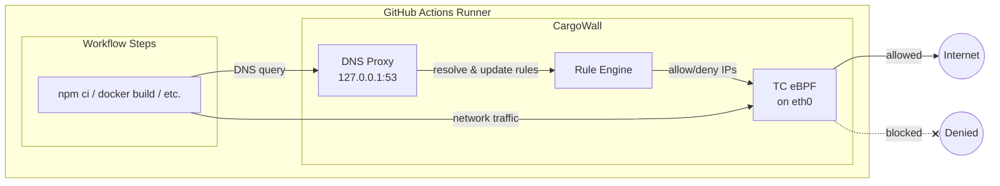

# CargoWall

[](https://github.com/code-cargo/cargowall/actions/workflows/ci.yml)
[](https://github.com/code-cargo/cargowall/actions/workflows/release.yml)
[](https://opensource.org/licenses/Apache-2.0)

**The firewall for GitHub Actions.**

CargoWall is an **eBPF-based network firewall for GitHub Actions runners** that monitors and controls outbound connections during CI/CD runs.

It protects your pipelines from **malicious actions, dependency supply chain attacks, and secret exfiltration** — with just a single step added to your workflow jobs.

CargoWall is open source and built by the team behind CodeCargo.

**Get started with the [CargoWall GitHub Action](https://github.com/code-cargo/cargowall-action).**

---

# Why This Exists

Modern CI/CD pipelines run **untrusted code** every day.

Your workflows execute:

* third-party GitHub Actions
* package installers
* build tools
* test frameworks
* deployment scripts

All with access to **sensitive credentials**:

* cloud keys
* registry tokens
* deploy keys
* signing secrets

If one dependency or action is compromised, attackers can silently:

* exfiltrate secrets
* tamper with build artifacts
* push malicious releases

This has already happened across the ecosystem.

CI/CD pipelines are now **one of the largest attack surfaces in software delivery**.

CargoWall exists to **put a firewall in front of your pipeline.**

---

# What CargoWall Does

CargoWall runs inside the GitHub runner and:

* monitors all outbound network connections
* blocks unauthorized destinations
* detects unexpected network activity
* prevents secret exfiltration
* logs all external connections made by the workflow

This is enforced using **kernel-level eBPF hooks** for minimal overhead and strong enforcement.

---

# What Makes CargoWall Different

Most CI/CD security tools are **static scanners**.

CargoWall protects the pipeline **while it is running**.

* **Runtime network firewall** — not a static scanner, enforces policy while your workflow runs
* **Kernel-level eBPF enforcement** — TC egress filters in kernel space, not userspace proxies
* **Process attribution** — every connection is traced back to the process and PID that initiated it
* **Dynamic DNS resolution** — hostname rules are resolved at runtime via a local DNS proxy
* **Audit and enforce modes** — start with visibility, then switch to blocking when ready
* **NDJSON audit logs** — machine-readable logs for compliance evidence and SIEM integration

---

# Get Started

Add the [CargoWall GitHub Action](https://github.com/code-cargo/cargowall-action) to your workflow:

```yaml
- uses: code-cargo/cargowall-action@v1
  with:
    default-action: deny
    allowed-hosts: |
      github.com,
      registry.npmjs.org
```

Hostname rules support **glob patterns** for matching dynamic hostnames:

- `*` matches exactly one DNS label
- `**` matches one or more DNS labels
- Wildcards must be a full dot-separated segment — partial wildcards like `google.co*` are not supported

```yaml
allowed-hosts: |
  github.com,
  actions.githubusercontent.com.*.*.internal.cloudapp.net,
  **.storage.azure.com
```

See the [cargowall-action README](https://github.com/code-cargo/cargowall-action) for full usage, inputs, outputs, and examples.

---

# How It Works



1. The CargoWall GitHub Action installs the CargoWall runtime on the runner.
2. CargoWall attaches **eBPF TC (Traffic Control) egress filters** to the runner's network interface using [cilium/ebpf](https://github.com/cilium/ebpf).
3. A **local DNS proxy** intercepts DNS queries, resolving hostnames to IPs and dynamically populating the firewall rules.
4. Outbound packets are matched against an **LPM trie** (longest-prefix match) in kernel space for CIDR and port-based rules.
5. **Cgroup socket hooks** (`connect4`/`connect6`/`sendmsg4`/`sendmsg6`) track which process (PID) initiated each connection.
6. Events are delivered to userspace via a **ring buffer** and written to an NDJSON audit log with full process attribution.

CargoWall supports both **audit mode** (log only, no blocking) and **enforce mode** (actively block denied traffic).

All enforcement happens **inside the runner at the kernel level** — no iptables, no sidecar proxy.

---

# CodeCargo Platform

Sign up for the [CodeCargo platform](https://www.codecargo.com) for enterprise features like:

* **Centralized policy management** — create, assign, and inherit CargoWall policies from a dashboard without touching workflow files
* **Organization-wide policies** with hierarchical overrides at the repo, workflow, and job level
* Role-based access control
* CI/CD governance and workflow run retention
* AI-powered capabilities including Multi-repo AI Editor, Self-service, AI Service Catalog, and Actions Insights

---

# Documentation

Full documentation:

[https://docs.codecargo.com/concepts/cargowall](https://docs.codecargo.com/concepts/cargowall)

---

# When Should You Use CargoWall?

CargoWall is especially valuable if you:

* rely on **third-party GitHub Actions**
* run CI/CD in **regulated environments**
* need **SOC2 / FedRAMP evidence for pipeline controls**
* want to prevent **CI/CD supply chain attacks**
* want visibility into **network activity during builds**

---

# Built With

* [Go](https://go.dev/)
* [cilium/ebpf](https://github.com/cilium/ebpf) — eBPF program loading and map management
* [miekg/dns](https://github.com/miekg/dns) — DNS proxy for runtime hostname resolution

---

# Security

If you discover a vulnerability, please report it responsibly.

See [`SECURITY.md`](SECURITY.md) for details.

---

# License

Apache 2.0

---

# Links

GitHub Action
[https://github.com/code-cargo/cargowall-action](https://github.com/code-cargo/cargowall-action)

Documentation
[https://docs.codecargo.com/concepts/cargowall](https://docs.codecargo.com/concepts/cargowall)

CodeCargo
[https://codecargo.com](https://codecargo.com)

---

