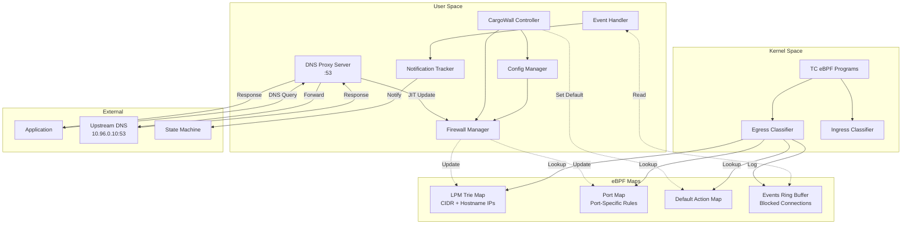
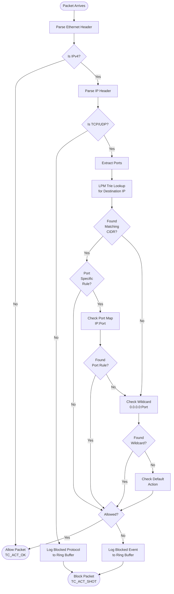
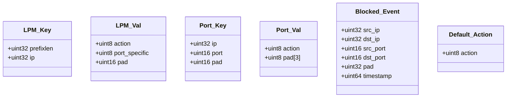
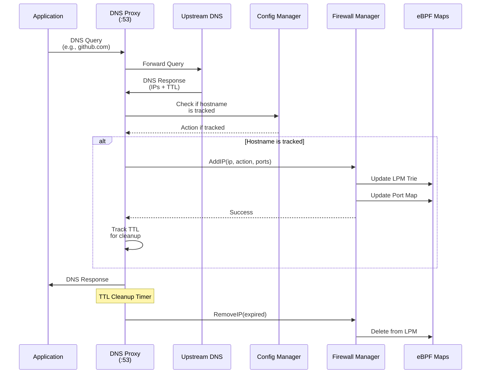

# Design

Leverages TC (Traffic Control) eBPF programs for efficient packet processing and egress filtering with integrated DNS proxy for Just-In-Time (JIT) hostname resolution.

## Key Features

- **L4 Firewall**: Filters TCP and UDP traffic based on CIDR blocks and hostnames
- **Protocol Blocking**: Blocks all non-TCP/UDP protocols (ICMP, IGMP, GRE, etc.) for security
- **DNS Proxy with JIT Resolution**: Intercepts DNS queries and updates firewall rules in real-time
- **Port-Specific Rules**: Support for granular port-based filtering
- **LPM Trie Optimization**: Uses Longest Prefix Match for efficient CIDR lookups
- **Real-time Monitoring**: Tracks blocked connections and sends notifications
- **TTL-Based Cleanup**: Automatically removes expired IPs based on DNS TTL values
- **Kubernetes Integration**: Supports Kubernetes service discovery and search domains

## Architecture Overview



## Packet Processing Flow (eBPF TC Program)



## eBPF Map Data Structures



## DNS Proxy JIT Resolution Flow



## Component Responsibilities

### Firewall Manager (`pkg/firewall`)
- Owns and manages eBPF maps
- Thread-safe operations with mutex protection
- Provides AddIP/RemoveIP interface
- Handles duplicate detection
- Updates both LPM trie and port maps

### DNS Proxy Server (`pkg/dns`)
- Listens on 127.0.0.1:53
- Intercepts all DNS queries from pod
- Forwards to upstream (default: 10.96.0.10:53)
- JIT updates firewall for tracked hostnames
- Manages TTL-based cleanup
- Supports Kubernetes search domains

### Config Manager (`pkg/config`)
- Loads configuration from file or state machine
- Tracks hostname rules without pre-resolution
- Manages DNS cache for IP-to-hostname lookups
- Detects rule conflicts
- Provides resolved rules for initial setup

### Event Handler (`pkg/events`)
- Processes blocked connection events from ring buffer
- Logs protocol blocks (non-TCP/UDP)

## Kubernetes Integration

```yaml
# Pod DNS Configuration
dnsPolicy: None
dnsConfig:
  nameservers: ["127.0.0.1"]  # Use CargoWall DNS proxy
  searches:
    - "default.svc.cluster.local"
    - "svc.cluster.local"
    - "cluster.local"
  options:
    - name: ndots
      value: "5"
```

The DNS proxy handles Kubernetes service discovery by:
1. Supporting search domains for short service names
2. Stripping common suffixes when checking rules
3. Allowing rules to match both short and FQDN formats
