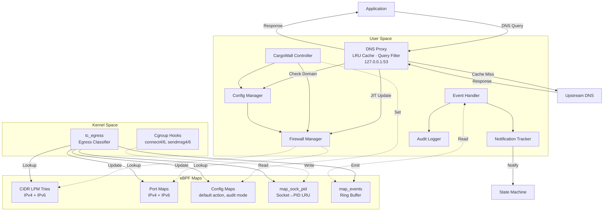
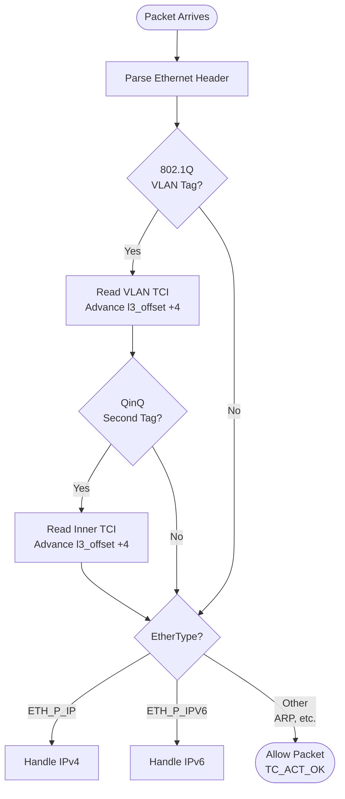
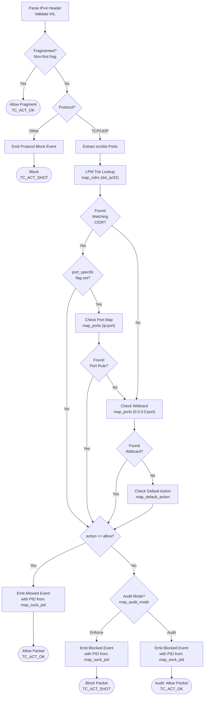
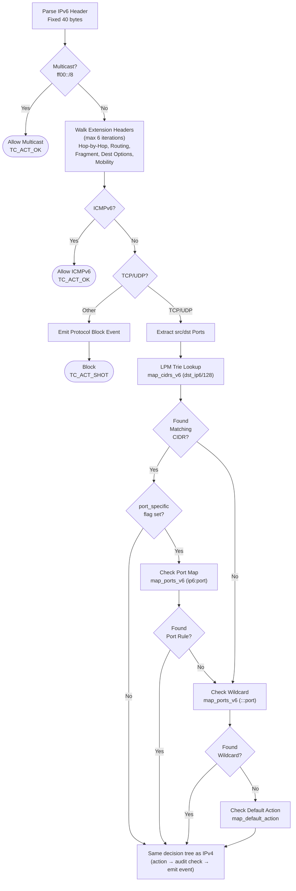
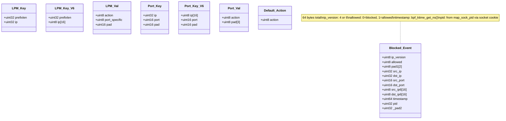
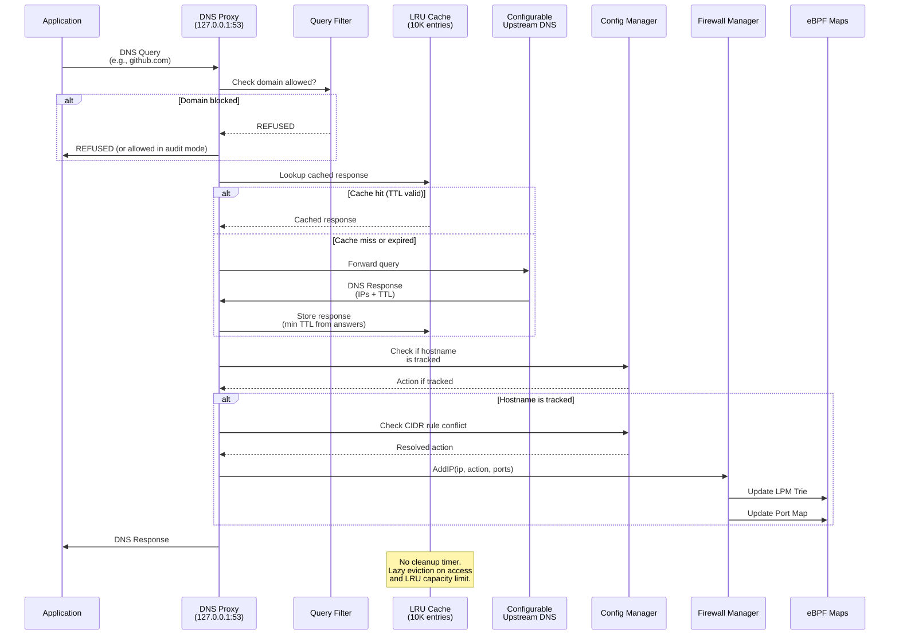

# Design

Dual-stack (IPv4/IPv6) L4 firewall using TC eBPF egress filtering, cgroup socket hooks for PID tracking, an integrated DNS proxy for JIT hostname resolution, and an audit mode for log-only operation.

## Key Features

- **Dual-Stack L4 Firewall**: Filters TCP and UDP traffic on both IPv4 and IPv6
- **Protocol Handling**: Blocks non-TCP/UDP on IPv4; allows ICMPv6 and IPv6 multicast (`ff00::/8`); passes non-IP traffic (ARP)
- **DNS Proxy with JIT Resolution**: Intercepts DNS queries and updates firewall rules in real-time
- **DNS Query Filtering**: Blocks queries for non-allowed domains to prevent DNS tunneling
- **Port-Specific Rules**: Granular port-based filtering including wildcard CIDRs (`0.0.0.0/0`, `::/0`)
- **LPM Trie Optimization**: Separate IPv4 and IPv6 longest-prefix-match tries for efficient CIDR lookups
- **Process/PID Tracking**: Cgroup socket hooks map socket cookies to PIDs for per-process attribution
- **Audit Mode**: Log-only mode — events are emitted but traffic is never dropped
- **Audit Logging**: NDJSON log file with structured event records
- **Real-time Monitoring**: Ring buffer event stream with notification deduplication via state machine
- **DNS LRU Cache**: 10,000-entry cache with lazy TTL eviction
- **VLAN Support**: Handles 802.1Q and QinQ (802.1ad) tagged frames
- **Docker Integration**: Listens on bridge IP, configures daemon DNS
- **GitHub Actions Integration**: Auto-infrastructure discovery, iptables DNS redirect, sudo lockdown
- **Kubernetes Integration**: Search domain stripping, configurable upstream DNS

## Architecture Overview



## Packet Processing Flow (eBPF TC Egress)

### Main Dispatch



### IPv4 Path



### IPv6 Path



## eBPF Map Data Structures



## DNS Proxy JIT Resolution Flow



## Component Responsibilities

### Firewall Manager (`pkg/firewall`)
- Manages 8 eBPF maps: `map_cidrs`, `map_cidrs_v6`, `map_ports`, `map_ports_v6`, `map_default_action`, `map_audit_mode`, `map_events`, `map_sock_pid`
- Separate IPv4/IPv6 methods (`addCIDRv4`, `addCIDRv6`) with appropriate key types
- `SetDefaultAction(action)` — sets `map_default_action[0]` to 0 (deny) or 1 (allow)
- `SetAuditMode(enabled)` — sets `map_audit_mode[0]` to 0 (enforce) or 1 (audit)
- `AddIP(ip, action, ports)` — adds /32 or /128 entry with duplicate detection; returns whether entry was added
- `RemoveIP(ip)` — removes LPM entry and all associated port map entries
- Wildcard CIDR handling: `0.0.0.0/0` and `::/0` with specific ports add only port map entries (no LPM entry)
- Tracks IP-to-port associations (`ipPorts` map) for accurate cleanup on removal
- Thread-safe with `sync.RWMutex`

### DNS Proxy Server (`pkg/dns`)
- Primary listen address `127.0.0.1:53`, with additional addresses (e.g., Docker bridge IP) via `AddListenAddr()`
- Configurable upstream DNS (e.g., `10.96.0.10:53` for Kubernetes)
- LRU cache (10,000 entries) with per-entry TTL from DNS response minimum TTL
- DNS query filtering (`EnableQueryFiltering`) — blocks queries for non-allowed domains; always allows reverse DNS (`in-addr.arpa`, `ip6.arpa`)
- `ApplyRulesToTrackedHostnames()` — re-evaluates all accumulated IPs against current config after rule changes
- Rule conflict detection: checks CIDR vs hostname action conflicts via `CheckIPRuleConflict()`; deny wins
- Kubernetes search domain stripping (`.default.svc.cluster.local`, `.svc.cluster.local`, `.cluster.local`)
- Accumulates IPs per hostname across responses for round-robin DNS support
- Audit logging of blocked DNS queries

### Config Manager (`pkg/config`)
- Multiple config sources with priority: API > env vars > file > protobuf hook
  - Env vars: `CARGOWALL_DEFAULT_ACTION`, `CARGOWALL_ALLOWED_HOSTS`, `CARGOWALL_ALLOWED_CIDRS`, `CARGOWALL_BLOCKED_HOSTS`, `CARGOWALL_BLOCKED_CIDRS`
  - Port format in env: `host:port1;port2` (e.g., `github.com:443;80`)
- Subdomain matching: `lb-140-82-113-22-iad.github.com` matches a `github.com` rule
- Wildcard hostname normalization: `*.github.com` → `github.com` (parent domain matching handles subdomains)
- IP-to-hostname reverse mapping via `UpdateDNSMapping()` with bounded cache (10,000 entries, 24h TTL)
- Rule conflict detection: `CheckIPRuleConflict()` finds most specific CIDR by prefix length, checks port overlap, deny wins
- `EnsureDNSAllowed(ips)` — adds /32 allow rules on port 53 for upstream DNS IPs
- `EnsureInfraAllowed(ips, ports)` — adds allow rules for infrastructure (Azure IMDS, K8s API, etc.)
- `EnsureHostnameAllowed(hostname)` — adds hostname allow rule for auto-discovered infrastructure

### Event Handler (`pkg/events`)
- Processes both blocked and allowed events from ring buffer (`ip_version`, `allowed`, ports, IPs)
- PID tracking: reads `pid` field (populated by cgroup programs via `map_sock_pid`), resolves process name from `/proc/<pid>/comm`
- Lazy reverse DNS: bounded cache (10,000 entries), one PTR attempt per unique IP (500ms timeout), falls back to forward-matching tracked hostnames
- Late-resolved IP addition: if a blocked event resolves to an allowed hostname, adds the IP to the firewall on the fly
- Audit logging via `AuditLogger` — NDJSON with `would_deny`/`blocked` flags based on audit mode
- Notification deduplication: one notification per unique destination (`hostname:port` or `ip:port`) via `NotificationTracker`

## eBPF Programs

| Program | Attach Type | Purpose |
|---------|------------|---------|
| `tc_egress` | TC (classifier/egress) | Main egress filter — IPv4/IPv6 packet classification and filtering |
| `tc_ingress` | TC (classifier/ingress) | Defined but not attached; stub that allows all traffic |
| `cg_connect4` | cgroup/connect4 | Maps IPv4 TCP socket cookie → PID |
| `cg_connect6` | cgroup/connect6 | Maps IPv6 TCP socket cookie → PID |
| `cg_sendmsg4` | cgroup/sendmsg4 | Maps IPv4 UDP socket cookie → PID |
| `cg_sendmsg6` | cgroup/sendmsg6 | Maps IPv6 UDP socket cookie → PID |

## Audit Mode

Audit mode allows CargoWall to run in a log-only configuration — all traffic decisions are recorded but no packets are dropped.

**Activation:**
- CLI flag at startup
- Environment variable: `CARGOWALL_AUDIT_MODE=true`
- API policy configuration

**BPF behavior:**
- `map_audit_mode[0]` is set to `1` (audit) or `0` (enforce)
- In audit mode, `tc_egress` returns `TC_ACT_OK` instead of `TC_ACT_SHOT` for would-be-blocked traffic
- Events are still emitted to the ring buffer with the same `allowed` field semantics

**DNS behavior:**
- Blocked DNS queries are logged but still forwarded to upstream
- Query filter returns the upstream response instead of `REFUSED`

**Audit log:**
- NDJSON format, one JSON object per line
- Each event includes `would_deny` (true in audit mode) and `blocked` (true in enforce mode) flags
- Event types: `connection_blocked`, `connection_allowed`, `protocol_blocked`, `dns_blocked`, `existing_connection`

## Kubernetes Integration

```yaml
# Pod DNS Configuration
dnsPolicy: None
dnsConfig:
  nameservers: ["127.0.0.1"]  # Use CargoWall DNS proxy
  searches:
    - "default.svc.cluster.local"
    - "svc.cluster.local"
    - "cluster.local"
  options:
    - name: ndots
      value: "5"
```

The DNS proxy handles Kubernetes service discovery by:
1. Supporting search domains for short service names
2. Stripping common suffixes (`.default.svc.cluster.local`, `.svc.cluster.local`, `.cluster.local`) when checking rules
3. Allowing rules to match both short and FQDN formats
4. Upstream DNS is configurable (e.g., `10.96.0.10:53` for kube-dns)

## Docker Integration

- `GetDockerBridgeIP()` discovers the `docker0` bridge address (typically `172.17.0.1`)
- DNS proxy listens on the bridge IP in addition to `127.0.0.1:53` so containers can resolve through CargoWall
- `ConfigureDockerDNS(bridgeIP)` writes `{"dns": ["<bridgeIP>"]}` to `/etc/docker/daemon.json` (with backup)
- Docker daemon requires a full restart (`systemctl restart docker`) for DNS changes — SIGHUP is not sufficient
- `RestoreDockerDNS()` restores the original daemon.json from backup on shutdown

## GitHub Actions Integration

- **DNS redirect:** iptables DNAT rules redirect all outbound DNS (port 53) to `127.0.0.1:53`, exempting the proxy's own upstream queries via `SO_MARK` (`0xCA12`)
- **Sudo lockdown:** writes `/etc/sudoers.d/cargowall-lockdown` with a NOPASSWD allowlist; removes the runner user from the `docker` group
- **Auto-infrastructure:** `EnsureInfraAllowed()` and `EnsureHostnameAllowed()` add rules for platform services (Azure IMDS, GitHub API, etc.)
- **Logging:** `slog.Handler` that formats messages as GitHub workflow commands (`::error::`, `::warning::`, `::debug::`)
