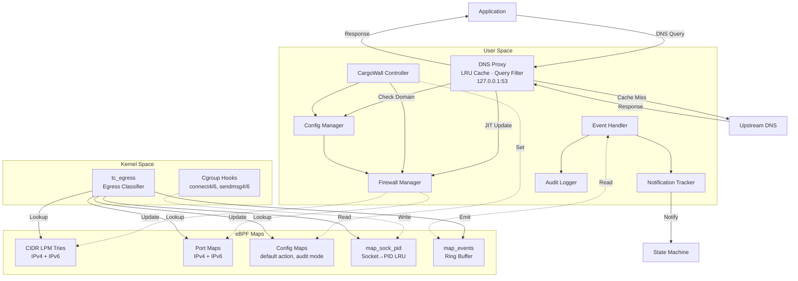
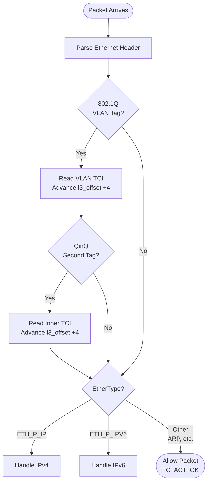
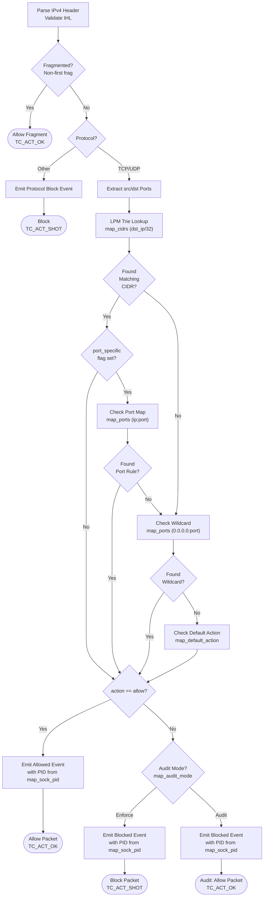
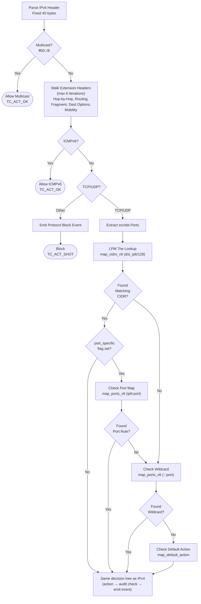
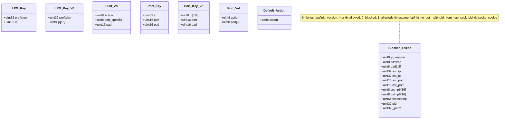
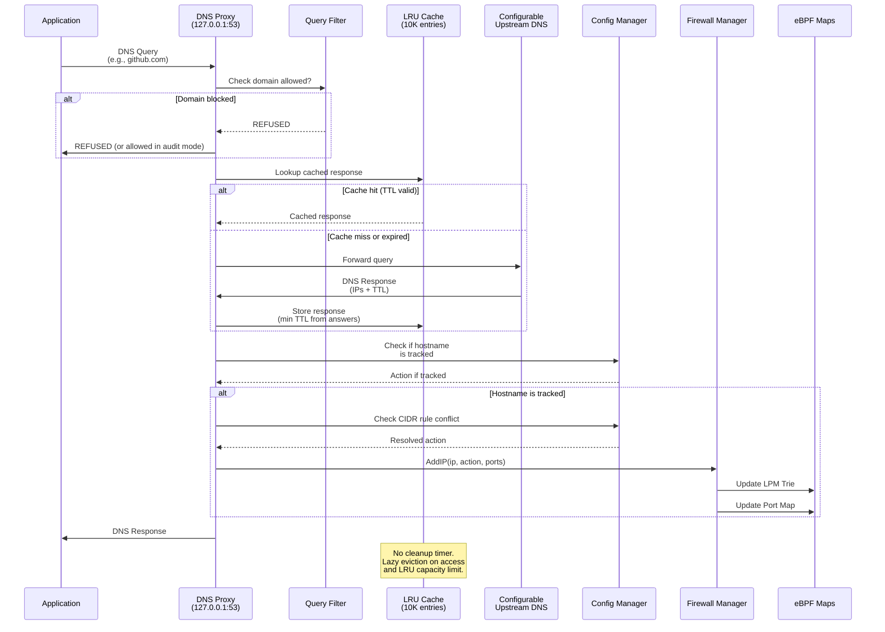

# Design

Dual-stack (IPv4/IPv6) L4 firewall using TC eBPF egress filtering, cgroup socket hooks for PID tracking, an integrated DNS proxy for JIT hostname resolution, and an audit mode for log-only operation.

## Key Features

- **Dual-Stack L4 Firewall**: Filters TCP and UDP traffic on both IPv4 and IPv6
- **Protocol Handling**: Blocks non-TCP/UDP on IPv4; allows ICMPv6 and IPv6 multicast (`ff00::/8`); passes non-IP traffic (ARP)
- **DNS Proxy with JIT Resolution**: Intercepts DNS queries and updates firewall rules in real-time
- **Hostname Glob Patterns**: `*` (one label) and `**` (one or more labels) wildcards for matching dynamic hostnames
- **DNS Query Filtering**: Blocks queries for non-allowed domains to prevent DNS tunneling
- **Port-Specific Rules**: Granular port-based filtering including wildcard CIDRs (`0.0.0.0/0`, `::/0`)
- **LPM Trie Optimization**: Separate IPv4 and IPv6 longest-prefix-match tries for efficient CIDR lookups
- **Process/PID Tracking**: Cgroup socket hooks map socket cookies to PIDs for per-process attribution
- **Audit Mode**: Log-only mode — events are emitted but traffic is never dropped
- **Audit Logging**: NDJSON log file with structured event records
- **Real-time Monitoring**: Ring buffer event stream with notification deduplication via state machine
- **DNS LRU Cache**: 10,000-entry cache with lazy TTL eviction
- **VLAN Support**: Handles 802.1Q and QinQ (802.1ad) tagged frames
- **Docker Integration**: Listens on bridge IP, configures daemon DNS
- **GitHub Actions Integration**: Auto-infrastructure discovery, iptables DNS redirect, sudo lockdown
- **Kubernetes Integration**: Search domain stripping, configurable upstream DNS

## Architecture Overview


```mermaid
flowchart TD
    APP[Application]
    UP[Upstream DNS]

    subgraph "User Space"
        DNS["DNS Proxy<br/>LRU Cache · Query Filter<br/>127.0.0.1:53"]
        UC[CargoWall Controller]
        CM[Config Manager]
        FW[Firewall Manager]
        EH[Event Handler]
        NT[Notification Tracker]
        AL[Audit Logger]
    end

    subgraph "Kernel Space"
        EG[tc_egress<br/>Egress Classifier]
        CG["Cgroup Hooks<br/>connect4/6, sendmsg4/6"]
    end

    subgraph "eBPF Maps"
        CIDRS["CIDR LPM Tries<br/>IPv4 + IPv6"]
        PORTS["Port Maps<br/>IPv4 + IPv6"]
        CFG["Config Maps<br/>default action, audit mode"]
        SP[map_sock_pid<br/>Socket→PID LRU]
        RB[map_events<br/>Ring Buffer]
    end

    SM[State Machine]

    APP -->|DNS Query| DNS
    DNS -->|Response| APP
    DNS -->|Cache Miss| UP
    UP -->|Response| DNS
    DNS -->|Check Domain| CM
    DNS -->|JIT Update| FW

    UC --> CM
    UC --> FW
    CM --> FW
    FW -.->|Update| CIDRS
    FW -.->|Update| PORTS
    UC -.->|Set| CFG

    CG -.->|Write| SP
    EG -->|Read| SP
    EG -->|Lookup| CIDRS
    EG -->|Lookup| PORTS
    EG -->|Lookup| CFG
    EG -->|Emit| RB

    EH <-.->|Read| RB
    EH --> AL
    EH --> NT
    NT -->|Notify| SM
```

## Packet Processing Flow (eBPF TC Egress)

### Main Dispatch


```mermaid
flowchart TD
    Start([Packet Arrives])
    ParseEth[Parse Ethernet Header]
    IsVLAN{802.1Q<br/>VLAN Tag?}
    StripVLAN[Read VLAN TCI<br/>Advance l3_offset +4]
    IsQinQ{QinQ<br/>Second Tag?}
    StripQinQ[Read Inner TCI<br/>Advance l3_offset +4]
    CheckProto{EtherType?}

    IPv4Path[Handle IPv4]
    IPv6Path[Handle IPv6]
    AllowOther([Allow Packet<br/>TC_ACT_OK])

    Start --> ParseEth
    ParseEth --> IsVLAN
    IsVLAN -->|Yes| StripVLAN
    StripVLAN --> IsQinQ
    IsQinQ -->|Yes| StripQinQ
    StripQinQ --> CheckProto
    IsQinQ -->|No| CheckProto
    IsVLAN -->|No| CheckProto
    CheckProto -->|ETH_P_IP| IPv4Path
    CheckProto -->|ETH_P_IPV6| IPv6Path
    CheckProto -->|Other<br/>ARP, etc.| AllowOther
```

### IPv4 Path


```mermaid
flowchart TD
    ParseIP[Parse IPv4 Header<br/>Validate IHL]
    IsFrag{Fragmented?<br/>Non-first frag}
    AllowFrag([Allow Fragment<br/>TC_ACT_OK])
    IsTCPUDP{Protocol?}
    BlockProto[Emit Protocol Block Event]
    BlockShot([Block<br/>TC_ACT_SHOT])
    ParsePorts[Extract src/dst Ports]

    LPMLookup["LPM Trie Lookup<br/>map_cidrs (dst_ip/32)"]
    HasRule{Found<br/>Matching<br/>CIDR?}

    IsPortSpecific{port_specific<br/>flag set?}
    CheckPort["Check Port Map<br/>map_ports (ip:port)"]
    HasPortRule{Found<br/>Port Rule?}

    CheckWildcard["Check Wildcard<br/>map_ports (0.0.0.0:port)"]
    HasWildcard{Found<br/>Wildcard?}

    CheckDefault["Check Default Action<br/>map_default_action"]
    IsAllowed{action == allow?}

    AuditCheck{Audit Mode?<br/>map_audit_mode}
    EmitAllow[Emit Allowed Event<br/>with PID from map_sock_pid]
    EmitBlock[Emit Blocked Event<br/>with PID from map_sock_pid]
    EmitAudit[Emit Blocked Event<br/>with PID from map_sock_pid]
    Allow([Allow Packet<br/>TC_ACT_OK])
    Block([Block Packet<br/>TC_ACT_SHOT])
    AuditAllow([Audit: Allow Packet<br/>TC_ACT_OK])

    ParseIP --> IsFrag
    IsFrag -->|Yes| AllowFrag
    IsFrag -->|No| IsTCPUDP
    IsTCPUDP -->|Other| BlockProto
    BlockProto --> BlockShot
    IsTCPUDP -->|TCP/UDP| ParsePorts

    ParsePorts --> LPMLookup
    LPMLookup --> HasRule
    HasRule -->|Yes| IsPortSpecific
    HasRule -->|No| CheckWildcard

    IsPortSpecific -->|No| IsAllowed
    IsPortSpecific -->|Yes| CheckPort
    CheckPort --> HasPortRule
    HasPortRule -->|Yes| IsAllowed
    HasPortRule -->|No| CheckWildcard

    CheckWildcard --> HasWildcard
    HasWildcard -->|Yes| IsAllowed
    HasWildcard -->|No| CheckDefault

    CheckDefault --> IsAllowed
    IsAllowed -->|Yes| EmitAllow --> Allow
    IsAllowed -->|No| AuditCheck
    AuditCheck -->|Enforce| EmitBlock --> Block
    AuditCheck -->|Audit| EmitAudit --> AuditAllow
```

### IPv6 Path


```mermaid
flowchart TD
    ParseIPv6[Parse IPv6 Header<br/>Fixed 40 bytes]
    IsMulticast{"Multicast?<br/>ff00::/8"}
    AllowMcast([Allow Multicast<br/>TC_ACT_OK])

    WalkExtHdr["Walk Extension Headers<br/>(max 6 iterations)<br/>Hop-by-Hop, Routing,<br/>Fragment, Dest Options,<br/>Mobility"]
    IsICMPv6{ICMPv6?}
    AllowICMP([Allow ICMPv6<br/>TC_ACT_OK])
    IsTCPUDP{TCP/UDP?}
    BlockProto[Emit Protocol Block Event]
    BlockShot([Block<br/>TC_ACT_SHOT])
    ParsePorts[Extract src/dst Ports]

    LPMLookup["LPM Trie Lookup<br/>map_cidrs_v6 (dst_ip6/128)"]
    HasRule{Found<br/>Matching<br/>CIDR?}

    IsPortSpecific{port_specific<br/>flag set?}
    CheckPort["Check Port Map<br/>map_ports_v6 (ip6:port)"]
    HasPortRule{Found<br/>Port Rule?}

    CheckWildcard["Check Wildcard<br/>map_ports_v6 (:::port)"]
    HasWildcard{Found<br/>Wildcard?}

    CheckDefault["Check Default Action<br/>map_default_action"]
    Decision["Same decision tree as IPv4<br/>(action → audit check → emit event)"]

    ParseIPv6 --> IsMulticast
    IsMulticast -->|Yes| AllowMcast
    IsMulticast -->|No| WalkExtHdr
    WalkExtHdr --> IsICMPv6
    IsICMPv6 -->|Yes| AllowICMP
    IsICMPv6 -->|No| IsTCPUDP
    IsTCPUDP -->|Other| BlockProto
    BlockProto --> BlockShot
    IsTCPUDP -->|TCP/UDP| ParsePorts

    ParsePorts --> LPMLookup
    LPMLookup --> HasRule
    HasRule -->|Yes| IsPortSpecific
    HasRule -->|No| CheckWildcard

    IsPortSpecific -->|No| Decision
    IsPortSpecific -->|Yes| CheckPort
    CheckPort --> HasPortRule
    HasPortRule -->|Yes| Decision
    HasPortRule -->|No| CheckWildcard

    CheckWildcard --> HasWildcard
    HasWildcard -->|Yes| Decision
    HasWildcard -->|No| CheckDefault
    CheckDefault --> Decision
```

## eBPF Map Data Structures


```mermaid
classDiagram
    class LPM_Key {
        +uint32 prefixlen
        +uint32 ip
    }

    class LPM_Key_V6 {
        +uint32 prefixlen
        +uint8 ip[16]
    }

    class LPM_Val {
        +uint8 action
        +uint8 port_specific
        +uint16 pad
    }

    class Port_Key {
        +uint32 ip
        +uint16 port
        +uint16 pad
    }

    class Port_Key_V6 {
        +uint8 ip[16]
        +uint16 port
        +uint16 pad
    }

    class Port_Val {
        +uint8 action
        +uint8 pad[3]
    }

    class Blocked_Event {
        +uint8 ip_version
        +uint8 allowed
        +uint8 pad1[2]
        +uint32 src_ip
        +uint32 dst_ip
        +uint16 src_port
        +uint16 dst_port
        +uint8 src_ip6[16]
        +uint8 dst_ip6[16]
        +uint64 timestamp
        +uint32 pid
        +uint32 _pad2
    }
    note for Blocked_Event "64 bytes total\nip_version: 4 or 6\nallowed: 0=blocked, 1=allowed\ntimestamp: bpf_ktime_get_ns()\npid: from map_sock_pid via socket cookie"

    class Default_Action {
        +uint8 action
    }
```

## DNS Proxy JIT Resolution Flow


```mermaid
sequenceDiagram
    participant App as Application
    participant DNS as DNS Proxy<br/>(127.0.0.1:53)
    participant QF as Query Filter
    participant Cache as LRU Cache<br/>(10K entries)
    participant UP as Configurable<br/>Upstream DNS
    participant CM as Config Manager
    participant FW as Firewall Manager
    participant BPF as eBPF Maps

    App->>DNS: DNS Query<br/>(e.g., github.com)

    DNS->>QF: Check domain allowed?
    alt Domain blocked
        QF-->>DNS: REFUSED
        DNS->>App: REFUSED (or allowed in audit mode)
    end

    DNS->>Cache: Lookup cached response
    alt Cache hit (TTL valid)
        Cache-->>DNS: Cached response
    else Cache miss or expired
        DNS->>UP: Forward query
        UP->>DNS: DNS Response<br/>(IPs + TTL)
        DNS->>Cache: Store response<br/>(min TTL from answers)
    end

    DNS->>CM: Check if hostname<br/>is tracked
    CM-->>DNS: Action if tracked

    alt Hostname is tracked
        DNS->>CM: Check CIDR rule conflict
        CM-->>DNS: Resolved action

        DNS->>FW: AddIP(ip, action, ports)
        FW->>BPF: Update LPM Trie
        FW->>BPF: Update Port Map
    end

    DNS->>App: DNS Response

    Note over Cache: No cleanup timer.<br/>Lazy eviction on access<br/>and LRU capacity limit.
```

## Component Responsibilities

### Firewall Manager (`pkg/firewall`)
- Manages 8 eBPF maps: `map_cidrs`, `map_cidrs_v6`, `map_ports`, `map_ports_v6`, `map_default_action`, `map_audit_mode`, `map_events`, `map_sock_pid`
- Separate IPv4/IPv6 methods (`addCIDRv4`, `addCIDRv6`) with appropriate key types
- `SetDefaultAction(action)` — sets `map_default_action[0]` to 0 (deny) or 1 (allow)
- `SetAuditMode(enabled)` — sets `map_audit_mode[0]` to 0 (enforce) or 1 (audit)
- `AddIP(ip, action, ports)` — adds /32 or /128 entry with duplicate detection; returns whether entry was added
- `RemoveIP(ip)` — removes LPM entry and all associated port map entries
- Wildcard CIDR handling: `0.0.0.0/0` and `::/0` with specific ports add only port map entries (no LPM entry)
- Tracks IP-to-port associations (`ipPorts` map) for accurate cleanup on removal
- Thread-safe with `sync.RWMutex`

### DNS Proxy Server (`pkg/dns`)
- Primary listen address `127.0.0.1:53`, with additional addresses (e.g., Docker bridge IP) via `AddListenAddr()`
- Configurable upstream DNS (e.g., `10.96.0.10:53` for Kubernetes)
- LRU cache (10,000 entries) with per-entry TTL from DNS response minimum TTL
- DNS query filtering (`EnableQueryFiltering`) — blocks queries for non-allowed domains; always allows reverse DNS (`in-addr.arpa`, `ip6.arpa`). CNAME targets seen in an allowed response are learned (TTL-bounded, 10,000-entry LRU), each carrying the origin rule's allow ports (UNIONed across origins via `config.UnionPorts`). A learned target is both permitted for later direct queries and, when one resolves, has its IPs written to the allow map on the inherited ports — so a chain split across query round-trips (CDN-fronted PKI that returns a different Akamai/Cloudflare variant per query, dynamic edge labels) is enforced, not just un-refused. Learning is transitive (a derived-allowed response extends the chain) but bounded: `cnameChainTargets` follows only records connected to the query name, so injected/unrelated records are ignored; depth and lifetime are bounded by the LRU and per-hop TTL. Explicit deny rules still win. The trust model is unchanged in spirit — "allowing host H allows H's CNAME chain on H's ports"; the new behavior is reassembling that chain when it spans multiple responses
- `ApplyRulesToTrackedHostnames()` — re-evaluates all accumulated IPs against current config after rule changes
- Rule conflict detection: checks CIDR vs hostname action conflicts via `CheckIPRuleConflict()`; deny wins
- Kubernetes search domain stripping (`.default.svc.cluster.local`, `.svc.cluster.local`, `.cluster.local`)
- Accumulates IPs per hostname across responses for round-robin DNS support
- Audit logging of blocked DNS queries

### Config Manager (`pkg/config`)
- Multiple config sources with priority: API > env vars > file > protobuf hook
  - Env vars: `CARGOWALL_DEFAULT_ACTION`, `CARGOWALL_ALLOWED_HOSTS`, `CARGOWALL_ALLOWED_CIDRS`, `CARGOWALL_BLOCKED_HOSTS`, `CARGOWALL_BLOCKED_CIDRS`
  - Port format in env: `host:port1;port2` (e.g., `github.com:443;80`)
- Subdomain matching: `lb-140-82-113-22-iad.github.com` matches a `github.com` rule
- Glob pattern matching for hostnames: `*` matches one DNS label, `**` matches one or more (e.g., `actions.githubusercontent.com.*.*.internal.cloudapp.net`, `**.storage.azure.com`)
- IP-to-hostname reverse mapping via `UpdateDNSMapping()` with bounded cache (10,000 entries, 24h TTL)
- Rule conflict detection: `CheckIPRuleConflict()` finds most specific CIDR by prefix length, checks port overlap, deny wins
- `EnsureDNSAllowed(ips)` — adds /32 allow rules on port 53 for upstream DNS IPs
- `EnsureInfraAllowed(ips, ports)` — adds allow rules for infrastructure (Azure IMDS, K8s API, etc.)
- `EnsureHostnameAllowed(hostname)` — adds hostname allow rule for auto-discovered infrastructure

### Event Handler (`pkg/events`)
- Processes both blocked and allowed events from ring buffer (`ip_version`, `allowed`, ports, IPs)
- PID tracking: reads `pid` field (populated by cgroup programs via `map_sock_pid`), resolves process name from `/proc/<pid>/comm`
- Lazy reverse DNS: bounded cache (10,000 entries), one PTR attempt per unique IP (500ms timeout), falls back to forward-matching tracked hostnames
- Late-resolved IP addition: if a blocked event resolves to an allowed hostname, adds the IP to the firewall on the fly
- Audit logging via `AuditLogger` — NDJSON with `would_deny`/`blocked` flags based on audit mode
- Notification deduplication: one notification per unique destination (`hostname:port` or `ip:port`) via `NotificationTracker`
- Event fan-out: `AuditLogger` also tees every event (after mode-flag normalization) to registered `EventSink`s; sinks must not block. With an empty path it acts as a file-less event hub, so sinks work without `--audit-log`

### OTLP Exporter (`pkg/otlp`)
- Streams every audit event to an OTLP/HTTP logs endpoint as one log record per event, enabled iff the standard `OTEL_EXPORTER_OTLP[_LOGS]_ENDPOINT` env var is set
- Hand-rolled exporter — no OpenTelemetry SDK dependency; OTLP protos are generated from `buf.build/opentelemetry/opentelemetry` (see `proto/buf.gen.otlp.yaml`) and marshaled with the existing `google.golang.org/protobuf` dep, so `go.mod` gains nothing
- `http/protobuf` transport only; misconfiguration (e.g. `OTEL_EXPORTER_OTLP_PROTOCOL=grpc`) logs a warning and disables export without affecting the firewall
- Delivery is best-effort by design: bounded queue (2048) with non-blocking enqueue so the ring-buffer reader and DNS handler never stall; batches of 512 records or 5s; jittered exponential backoff on 429/5xx honoring `Retry-After`; drops (counted and logged) rather than backpressure
- Shutdown flushes queued events with a 5s-bounded context before the audit logger closes

## eBPF Programs

| Program | Attach Type | Purpose |
|---------|------------|---------|
| `tc_egress` | TC (classifier/egress) | Main egress filter — IPv4/IPv6 packet classification and filtering |
| `tc_ingress` | TC (classifier/ingress) | Defined but not attached; stub that allows all traffic |
| `cg_connect4` | cgroup/connect4 | Maps IPv4 TCP socket cookie → PID |
| `cg_connect6` | cgroup/connect6 | Maps IPv6 TCP socket cookie → PID |
| `cg_sendmsg4` | cgroup/sendmsg4 | Maps IPv4 UDP socket cookie → PID |
| `cg_sendmsg6` | cgroup/sendmsg6 | Maps IPv6 UDP socket cookie → PID |
| `step_fork` / `step_exit` | tp_btf tracepoints (stepbpf.c, separate collection; needs kernel BTF) | Step attribution: mint/inherit per-step process tags, drop at exit |
| `cg_sock_create` | cgroup/sock_create (stepbpf.c) | Copies the creating thread's step tag onto each socket cookie |
| `cg_origin_egress` | cgroup_skb/egress (originbpf.c, separate collection) | Flow-origin recorder and — in enforce mode — the primary egress verdict (issue #106). Runs in socket context, pre-NAT, inside the originating netns, so it can both attribute and enforce container traffic. Behavior is set by a runtime mode: observe (pass, record only), shadow (compute the verdict, report would-blocks, pass), enforce (drop denied traffic). Shares the rule maps with `tc_egress` via `bpf/verdict.h` |

## Audit Mode

Audit mode allows CargoWall to run in a log-only configuration — all traffic decisions are recorded but no packets are dropped.

**Activation:**
- CLI flag at startup
- Environment variable: `CARGOWALL_AUDIT_MODE=true`
- API policy configuration

**BPF behavior:**
- `map_audit_mode[0]` is set to `1` (audit) or `0` (enforce)
- In audit mode, `tc_egress` returns `TC_ACT_OK` instead of `TC_ACT_SHOT` for would-be-blocked traffic
- Events are still emitted to the ring buffer with the same `allowed` field semantics

**DNS behavior:**
- Blocked DNS queries are logged but still forwarded to upstream
- Query filter returns the upstream response instead of `REFUSED`

**Audit log:**
- NDJSON format, one JSON object per line
- Each event includes `would_deny` (true in audit mode) and `blocked` (true in enforce mode) flags
- Event types: `connection_blocked`, `connection_allowed`, `protocol_blocked`, `dns_blocked`, `existing_connection`

## Kubernetes Integration

```yaml
# Pod DNS Configuration
dnsPolicy: None
dnsConfig:
  nameservers: ["127.0.0.1"]  # Use CargoWall DNS proxy
  searches:
    - "default.svc.cluster.local"
    - "svc.cluster.local"
    - "cluster.local"
  options:
    - name: ndots
      value: "5"
```

The DNS proxy handles Kubernetes service discovery by:
1. Supporting search domains for short service names
2. Stripping common suffixes (`.default.svc.cluster.local`, `.svc.cluster.local`, `.cluster.local`) when checking rules
3. Allowing rules to match both short and FQDN formats
4. Upstream DNS is configurable (e.g., `10.96.0.10:53` for kube-dns)

## Docker Integration

- `GetDockerBridgeIP()` discovers the `docker0` bridge address (typically `172.17.0.1`)
- DNS proxy listens on the bridge IP in addition to `127.0.0.1:53` so containers can resolve through CargoWall
- `ConfigureDockerDNS(bridgeIP)` writes `{"dns": ["<bridgeIP>"]}` to `/etc/docker/daemon.json` (with backup)
- Docker daemon requires a full restart (`systemctl restart docker`) for DNS changes — SIGHUP is not sufficient
- `RestoreDockerDNS()` restores the original daemon.json from backup on shutdown

### Container Attribution (issue #106, phase 3a — audit-only)

Bridge-networked container packets cross a netns and NAT before `tc_egress`
sees them, so the socket-cookie join yields nothing there (pid 0, ordinal 0).
Phase 3a closes the attribution gap without touching enforcement:

- `pkg/containers` subscribes to Docker events over `/var/run/docker.sock`
  (stdlib HTTP client, no docker dependency), resolves each container/exec
  workload's host PID, confirms identity via `/proc/<pid>/cgroup`, and tags
  the process subtree with the step ordinal active at the event's `timeNano`
  (`steps.Tracker.OrdinalAt` / `TagContainerProcess`). From there the
  existing `cg_sock_create` hook tags container sockets and kernel fork
  inheritance covers descendants.
- `pkg/origin` owns the `cg_origin_egress` observer: pre-NAT flow-origin
  records (socket cookie, cgroup id, container source IP) resolved against
  the pid/step maps at read time and kept in a bounded join store. TC events
  arriving with no socket identity are enriched from it (`Enrich`), keyed on
  what MASQUERADE preserves (dst tuple, usually the source port). Only the
  record's socket-tag ordinal is ever copied — never "current step" — so
  traffic from the start→tag window lands in the container tier, not a step.
- Container DNS: queries arriving on the bridge listener are attributed by
  container IP (`SetContainerLookup`); the host-netns sockdiag path is never
  consulted for them. **Known approximation:** the DNS path attributes a
  whole container to its *effective* ordinal — birth step, overwritten by
  each later `docker exec` (last-writer-wins) — because a DNS query carries
  only the client IP, not a socket tag. TC enrichment does not share this
  limit (it reads each socket's own tag from the origin record). No phase
  may treat DNS-path ordinals as per-socket causal attribution or as an
  enforcement input — the decided split lives in "DNS and per-step policy"
  below, next to the phase-3b invariants it interacts with.
- Unattributable container traffic gets its own summary tier ("Container
  traffic (unattributed…)"), checked before every looser bucket.
- Scope boundaries: docker-in-docker attribution stops at the outer
  container; `--privileged` containers are flagged in the audit stream.

### Egress enforcement hooks (issue #106, phase 3b)

Phase 3b makes the root-cgroup hook the *primary* egress verdict, with TC
egress kept attached as a fail-closed backstop. Both hooks compute the same
decision from the same maps: `bpf/verdict.h` owns the rule/config maps and
the `verdict_allowed_v4`/`_v6` helpers, and both collections include it —
a divergence between the primary hook and its backstop would be a security
bug, so the decision exists once and `TestVerdictParityWithTcEgress` proves
the two programs agree. `pkg/origin` wires the origin collection to the
tcbpf collection's map fds with `MapReplacements`, so there is one set of
kernel maps. (This deliberately reverses phase 3a's standalone-collection
isolation, whose purpose was to keep a verifier failure from touching
enforcement; the blast radius is now bounded by the mode gate and the TC
backstop instead.)

**Mode ladder** (`map_origin_config`, set by userspace, never at attach):

| Mode | Behavior | How it's selected |
|------|----------|-------------------|
| observe | Phase-3a behavior: always pass, record flow origins | container attribution off |
| shadow | Compute the verdict, emit `cgroup_would_block`, still pass | default with `--container-attribution` |
| enforce | Drop denied traffic here; a drop reports as `connection_blocked` | `--cgroup-enforce` |

Shadow is the default because this hook adjudicates surfaces TC never saw;
it measures that blast radius in production before anyone relies on
enforcement. Audit mode (`map_audit_mode`) still overrides everything — it
never drops, at either hook.

**Ordering.** The program is attached early (the join store needs it) but is
inert in observe until `enableMode` runs *after* the allowlist, auto-allows,
and existing-connection gating are programmed — the same
attach-before-program guard that makes TC attach last.

**What TC still enforces.** Traffic with no local socket in our cgroup root:
`AF_PACKET`/raw sends, non-IP frames, genuinely forwarded packets, TCP
minisockets — plus everything, if the cgroup hook fails to load or attach
(warn-only by design, because TC remains).

**One post-verdict pipeline.** Both hooks feed the same steps in
`pkg/events` (`outcome.go`): hostname/CNAME resolution, late-allow
reconciliation, the audit record, and the block notification. `processEvent`
supplies TC packets; `ReportVerdict` supplies cgroup verdict records. This
matters because a cgroup drop is the *only* event source for the traffic it
kills — the packet dies at `ip_finish_output`, before the TC qdisc — so if
that path were thinner, denials under `--cgroup-enforce` would silently lose
late-allow self-healing and hostname attribution. Container identity is
attached as decoration by `pkg/containers`; it never owns the outcome, since
most cgroup verdicts are host processes with no container at all.

**Shadow mode is intentionally dual-sourced.** In shadow, the cgroup hook
emits `cgroup_would_block` for a flow *and* TC still enforces it, possibly
emitting `connection_blocked` for the same flow. Both lines appear in the
audit log by design — that is how the two hooks' opinions are compared. The
summary and OTLP exporter exclude would-blocks so counts stay honest, and
any other consumer must do the same: **never sum `cgroup_would_block` with
`connection_blocked`**, and never treat a would-block as a policy outcome.

**Behavior changes to know about:**
- A cgroup drop surfaces at the socket layer rather than TC's silent
  blackhole — but the UX differs by protocol. UDP `sendto()`/`sendmsg()`
  fail fast with `EPERM`. TCP does NOT fail fast: the SYN is dropped in
  `ip_finish_output` and `tcp_connect()` short-circuits only on
  `ECONNREFUSED`, so the SYN retransmits from the timer and `connect()`
  eventually returns `ETIMEDOUT` — which is why originbpf.c's emit dedup
  expects blocked-flow SYN retransmits.
- The hook sees traffic TC never did — loopback (including the DNS proxy's
  own DNAT'd `127.0.0.1:53`) and the docker bridge. Loopback is carved out
  both in BPF and as a userspace `127.0.0.0/8` + `::1/128` allow rule;
  ICMP/ICMPv6 and IPv6 multicast are passed for PMTU and NDP. Docker bridge
  subnets are the same local-only class but are carved out via a map this
  collection OWNS (`map_local_nets`, never shared with TC) rather than the
  policy: subnet values are discovered from container config — i.e.
  workload-influenced — so they must not be able to widen off-host
  enforcement. A carved subnet exempts traffic only at this hook (returning
  it to its pre-3b unpoliced-locally posture); traffic leaving via the
  TC-attached interface still meets TC's untouched verdict, and a test pins
  that isolation. Because TC attaches to one interface (multi-interface
  hosts have pre-existing TC blind spots), entries are also validated
  before writing: only bridge-driver networks (their routes are on-link by
  construction; macvlan/ipvlan subnets are physical-network space and stay
  adjudicated), width-capped at /16 (v4) / /64 (v6), and refused when the
  subnet contains a real host interface address — claiming VPC/LAN space
  the host lives in is a bypass attempt, not a bridge. Coverage: networks
  are enumerated directly (GET /networks — no dependency on live
  containers), before the mode is raised (`preallowLocalNetworks`) and on
  network-create events thereafter, with per-container discovery as the
  backstop. Consequence, by design: container↔container and host↔container
  traffic on docker bridges is open under `--cgroup-enforce` — the policy
  governs what leaves the machine, exactly the scope TC enforced;
  inter-container isolation is docker network segmentation's job, not this
  firewall's.
- The DNS proxy's upstream queries carry `SO_MARK 0xCA12` and are exempted
  before any verdict, so a policy race can never let the proxy self-block
  the lookups that populate the allowlist.
- Container traffic denied by policy is dropped pre-NAT, so TC never sees
  it: the cgroup hook is the sole event source for those blocks, and its
  events carry native pid/step/container attribution with no join needed.

### DNS and per-step policy (decided 2026-08-08)

**Rule: DNS-path attribution is audit-only. No phase — current or future —
may use a DNS-derived ordinal as an enforcement input.**

**Host-path outcome taxonomy:** every host `dns_blocked` event
carries `step_attr_outcome` — how the sock_diag lookup (client source
address → cookie → `map_sock_step`) resolved: `ok`, `untagged` (socket
found, owner outside the Runner.Worker subtree), `not_found`,
`ambiguous_wildcard` (≥2 wildcard-bound candidates — declined, since
misattribution is worse than none), `dump_error`, `shed` (flood
back-pressure). Owned by `events.StepAttrOutcome` next to `AuditEvent` so
JSON, OTLP (`cargowall.step_attr_outcome`), the summary bucketing, and the
CI gate (`enforce.sh dns-attribution`, all-of-subset on `ok` + real
ordinal) share one vocabulary; events also carry the owner's pid/comm from
`map_sock_pid`. The summary routes `untagged` into its own "Host services"
tier — an identified outside owner (systemd units, daemons),
distinct from the unknown bucket that keeps the genuine lookup
limitations.

Binding on today's code, not just the future: `Tracker.LookupClient`'s
ordinal reaches no enforcement path. It DOES fan out as an audit
approximation (the `dns_blocked` event, and from there the summary's
per-step grouping, the SaaS push, and OTLP's `cargowall.step_ordinal`), so
consumers see a per-step-looking label that is really per-container
last-writer-wins. `DecorateVerdict` is the site one line away from
regressing this rule: it holds a `*containerInfo` and must keep stamping
only `ContainerOrigin`/`ContainerID` — never `effectiveOrdinal` — onto
connection outcomes.

**Why the signal is unfit for policy** (scoped precisely — container
identity is NOT the problem): a DNS query identifies the *container* (its
IP is unique per bridge network), but not the *process or step* within it.
One container spans steps (`effectiveOrdinal` is birth step overwritten by
each `docker exec`), and for embedded-resolver forwards on user-defined
networks the querying process's identity is laundered by the proxying
itself — the forwarding socket lives in the container's netns but is
created by dockerd, so socket-based lookups don't return "unknown", they
confidently return dockerd. Per-step granularity from this signal is not
achievable by any hook placement; per-container granularity is too coarse
to select policy with.

**The split** (what the per-step phase builds instead):
- *Query filtering stays run-wide and step-agnostic.* All of today's allow
  paths — rules, CNAME-derived allowances, search-domain suffixes, the
  default action — remain without a step dimension. Residual risk, stated
  honestly: this concedes cross-step DNS exfiltration. A compromised step
  may query any domain the run allows for anyone, and the connection
  verdict cannot see that channel (the query rides the proxy, whose
  upstream socket is mark-exempt). Accepted because the alternative rests
  on the unfit signal above; revisit only with a genuinely causal
  mechanism, none of which is currently known.
- *Per-step tightness is planned at the connection verdict* — future work,
  none of it exists yet. `verdict.h`'s maps and key structs have no step
  dimension, and the enforcing hook does not read `map_sock_step`.
  Constraints that phase must resolve, recorded now so they aren't
  rediscovered in review: (a) step-keyed rules mean re-keying the rule maps
  and every writer; (b) the "one decision, parity-tested" invariant above
  must be renegotiated, because a socket-keyed verdict is computable only
  at the cgroup hook — post-NAT TC has no socket — so parity would scope to
  the run-wide baseline with TC remaining the run-wide backstop (the
  existing degradation posture); (c) selection semantics follow the tagging
  model: sockets and container processes keep their *creating* step's tag,
  so a service container started in step 2 is governed by step 2's policy
  for its lifetime unless re-tagged by exec — per-step policy means "the
  policy of the step that created it", not "the step active now"; (d) the
  denial UX above applies — UDP fails fast with `EPERM`, TCP times out.

**Follow-ups deliberately NOT adopted as written** (each has a verified
flaw; redesign before building):
- Join-store lookup for direct-bridge DNS clients: the store keys by
  destination tuple only, and container→gateway traffic is not MASQUERADEd,
  so distinct netns port spaces can collide on `(bridgeIP, 53, UDP,
  srcPort)` and name the wrong container with no ambiguity signal; all
  container DNS shares one key under `perKeyMax`; the ringbuf reader races
  the query handler; and embedded-resolver forwards resolve to dockerd (see
  above). Usable only as a hint gated on source-IP agreement with the byIP
  index, never as a replacement for it.
- Active-ordinal set per container: requires handling the `exec_die` event
  (the tracker currently drops it unmatched) plus exec-id→ordinal
  bookkeeping, or the set only grows. "Strictest member" is undefined over
  opaque ordinals — on disagreement, degrade to the container-unattributed
  tier, the codebase's one existing ambiguity vocabulary.

## GitHub Actions Integration

- **DNS redirect:** iptables DNAT rules redirect all outbound DNS (port 53) to `127.0.0.1:53`, exempting sockets marked via `network.MarkDNSProxySocket` (`SO_MARK` `0xCA12`: the proxy's upstream client, its listeners, and the startup stub peeks). The systemd-resolved stub (`127.0.0.53`) is DNAT'd explicitly so a stub-following client's own socket reaches the proxy — attribution intact, no invisible warm-cache serving; `127.0.0.1` itself (the proxy listen) stays un-DNATed, and nss-resolve's D-Bus lookups remain covered by the attach-time cache flush. Install and teardown both flush dport-53 conntrack entries (ctnetlink): nat verdicts are stamped per flow at its first packet, so pre-install DNS flow state would otherwise keep bypassing the proxy (and post-teardown state would keep DNAT'ing to the dead proxy) until natural expiry
  - Flush mechanics (`pkg/network/conntrack.go`): dump + per-entry delete over `NETLINK_NETFILTER` — the kernel's flush path rejects `CTA_FILTER` with `EOPNOTSUPP` (filters are dump-only; verified on 6.8), the same reason `conntrack -D --dport` iterates in userspace. Netlink dumps are flow-controlled, so the default rcvbuf handles arbitrary table sizes (a 5k-entry table dumps in ~5ms, well inside the 2s deadline)
  - Scoped to dport 53: a full table flush would churn unrelated NAT state (Docker MASQUERADE bindings, established flows). Collateral within scope is deliberate: an in-flight UDP transaction costs one retry, while an established DNAT'd DNS-over-TCP stream is reset — its later packets miss the NAT verdict — which is the point at both call sites, since such a stream is either bypassing the proxy or aimed at a dead one. Loopback-destination entries (the DNAT'd `127.0.0.53` stub flows, direct `127.0.0.1` proxy flows) cost at most the same one-retry/reset when deleted: an in-flight reply recreates the entry — possibly reversed, which on `lo` matters not at all, since a reversed 127.x entry has loopback addresses on both sides and can never match a later external-resolver query. They stay in scope to keep the predicate simple, and the live test targets loopback for exactly that harmlessness. The proxy's own marked upstream flows re-match the mark RETURN rules on recreation
  - Reverse-direction guard: those costs only hold if the client speaks first. If the first packet after a delete comes from upstream (a reply in flight across the flush, a server-side segment on a DNS-over-TCP stream), conntrack re-creates the flow with upstream as ORIGINAL, stamps a null NAT binding (no nat rules face inbound), and every later client packet rides the reply direction — which never traverses nat OUTPUT — with an original tuple (dport = client's ephemeral port) no dport-53 flush can select. For a socket-reusing resolver (c-ares/Node holds one UDP socket per server) that is a persistent, invisible bypass. The redirect therefore installs `INPUT -p udp/tcp ! -i lo --sport 53 -m conntrack --ctstate NEW -j DROP` alongside the DNAT: dropping the packet destroys its unconfirmed entry, so the client's next packet is NEW forward and takes the DNAT — the already-budgeted retry/reset, now guaranteed regardless of which side speaks first. Legitimate replies ride ESTABLISHED entries and never match. Loopback is exempt (`! -i lo`): a reversed 127.x entry has loopback addresses on both sides, so it can only ever match loopback tuples — it can never capture a later external query, even though stub-destined `lo` traffic is now DNAT'd — and without the exemption a stub or proxy lookup in flight across the install flush would lose its reply and sit out the resolver timeout (5s for glibc)
  - Best-effort with a Warn at both call sites: idle entries age out in 30–120s, but an actively-used flow (an open DNS-over-TCP stream) refreshes its entry indefinitely — exactly the flow the flush exists to kill, which is why a failed flush is warned loudly rather than ignored
- **Sudo lockdown:** writes `/etc/sudoers.d/zz-cargowall-lockdown` with a NOPASSWD allowlist; removes the runner user from sudo-granting groups (`sudo`, `admin`, `wheel`) and the `docker` group; disables competing sudoers.d files by renaming them to `*.cargowall-disabled`
- **Auto-infrastructure:** `EnsureInfraAllowed()` and `EnsureHostnameAllowed()` add rules for platform services (Azure IMDS, GitHub API, etc.)
- **Logging:** `slog.Handler` that formats messages as GitHub workflow commands (`::error::`, `::warning::`, `::debug::`)
